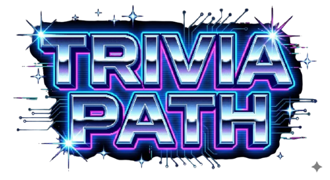

# 🎮 Trivia Path - AI Party Game

> **Benvenuti in Trivia Path**, un rivoluzionario party game locale dove la cultura generale incontra la strategia e l'Intelligenza Artificiale.
> Immergiti in un mondo **Pixel Art** vibrante, sfida i tuoi amici e interagisci con un **Host virtuale** che parla, commenta e reagisce alle tue giocate in tempo reale.

---

### 🎬 Gameplay Trailer
**Guarda il trailer ufficiale del gameplay:**

🎥 **[CLICCA QUI PER GUARDARE IL TRAILER SU YOUTUBE](https://youtu.be/_0ERndw_HRE)**

---

## ✨ Caratteristiche Principali

* **🧠 AI-Powered (Google Gemini):** Nessun database statico! Tutte le domande, le opzioni e gli indizi sono generati al volo, garantendo partite sempre diverse e infinite.
* **🗣️ Host Vocale Dinamico:** Un presentatore animato che legge le domande e commenta i risultati con voce realistica sincronizzata.
* **🎨 Grafica Pixel Art:** Animazioni fluide, effetti particellari (pioggia, coriandoli, neve), overlay CRT retrò e avatar personalizzabili.
* **⚙️ Strategia Profonda:** Non basta sapere la risposta; devi saper gestire il rischio, scommettere i tuoi punti e sabotare gli avversari.

---

## 📥 Come Installare e Giocare

È semplicissimo, non serve alcuna configurazione tecnica.

1.  **Scarica il Gioco:**
    Scarica l'ultimo file di installazione **`TriviaPath_Setup.msi`** direttamente da questo link:
    👉 **[SCARICA L'INSTALLER QUI (Google Drive)](https://drive.google.com/file/d/1bN-Ujwa0TXeQ19UIVHxU5j9n4rBwnwnC/view?usp=sharing)**

2.  **Installa:**
    Apri il file scaricato e segui la procedura guidata di Windows. Durante l'installazione potrai selezionare la cartella di destinazione in cui installare il gioco.

3.  **Gioca!**
    Una volta terminato, troverai l'icona di **Trivia Path** sul tuo Desktop o nel menu Start. Non è necessaria alcuna API Key o configurazione aggiuntiva.

---

## 🏆 Obiettivo del Gioco

Lo scopo è semplice: **rimanere l'ultimo giocatore in vita** o avere il punteggio più alto quando scade il tempo.

Ogni giocatore inizia con:
* **3 Vite (Cuori)** ❤️
* **0 Punti**
* **3 Aiuti Strategici**

### ❤️ Sistema delle Vite
* **Risposta Errata:** Perdi **1 Vita**.
* **0 Vite:** Sei eliminato (Game Over).
* **BONUS STREAK:** Se hai meno di 3 vite e rispondi correttamente a **5 domande di fila**, guadagni un cuore extra! ❤️➕

---

## 🕹️ Regole e Meccaniche

Il gioco non è lineare! Un "Regista Virtuale" può attivare eventi speciali in qualsiasi momento.

### 1. Il Flusso del Turno
1.  **Generazione:** L'IA crea la domanda.
2.  **Lettura:** L'Host legge la domanda (puoi saltare premendo `SPAZIO`).
3.  **Risposta:** Seleziona e conferma la tua scelta.
4.  **Esito:**
    * *Esatto:* +100 punti (base).
    * *Sbagliato:* -50 punti (base) e -1 Vita.

### 2. Eventi Speciali & Attacchi
* **💰 Betting (Scommesse):** Scommetti una parte dei tuoi punti. Se indovini vinci, se sbagli perdi la posta.
* **🔥 Risk Mode:** Una domanda "Molto Difficile" per **Punti Doppi (x2)**. Accetti la sfida?
* **😈 Malus Mode (Attacco):** Scegli un avversario da colpire.
    * *Indovini:* La vittima perde **100 punti**.
    * *Sbagli:* Il Karma ti punisce e **perdi 200 punti**.
* **🥷 Steal Points (Furto):** Ruba punti direttamente a un avversario. Se sbagli, glieli regali!
* **⏱️ Speedrun:** Parte un countdown di 10 secondi. Rispondi velocemente o perdi il turno.

### 3. Gli Aiuti (Lifelines)
Hai 3 aiuti per tutta la partita:
* **50:50:** Elimina due risposte errate.
* **SWITCH:** Cambia la domanda corrente con una nuova.
* **HINT (Indizio AI):** Chiedi un suggerimento all'IA. L'Host ti darà un indizio (spesso sarcastico ma utile).

### ⚔️ Il Duello Finale (Sudden Death)
Quando restano solo **2 Giocatori**:
* Sfondo Rosso e Musica Epica.
* Difficoltà domande al massimo.
* **Nessun Aiuto disponibile.**
* Vince chi sopravvive.

---

## 🎮 Comandi

| Tasto | Azione |
| :--- | :--- |
| **Mouse** | Navigazione menu, selezione risposte, uso aiuti |
| **Spazio** | Salta animazioni testo / Salta intro vocale |
| **Rotellina** | Scorri la classifica giocatori |
| **Pulsante PAUSA** | Ferma il gioco (in alto a sinistra) |
| **F3** | **Menu Debug** (Per testare eventi forzati) |

---

## 📄 Licenza e Copyright

**Copyright © 2025 David Aulicino (27/04/1993 - Italia)**
**Tutti i diritti riservati.**

Questo software è fornito esclusivamente a scopo dimostrativo (Portfolio).

* È **severamente vietato** copiare, modificare, distribuire, vendere o utilizzare qualsiasi parte di questo software per scopi commerciali o personali senza autorizzazione scritta dell'autore.
* L'uso è limitato alla visualizzazione e al test personale.

📩 **Contatti:** [linkedin.com/in/david-aulicino-b9371648]

---
*Trivia Path - Code by David Aulicino*
